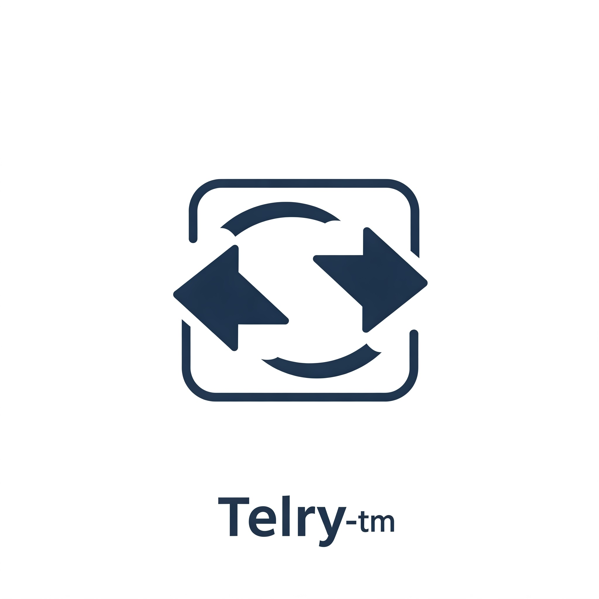
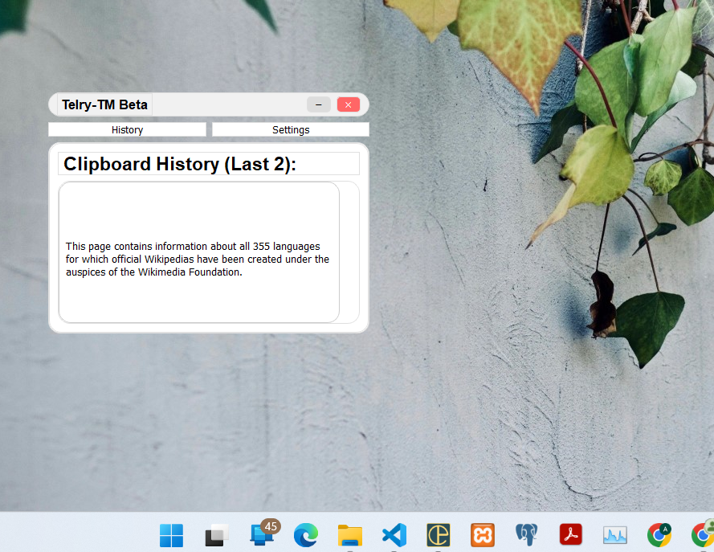

# Telry-tm: Reverse copy and paste tool

## 📸 Logo
  

**Telry-tm** lets you switch between your last two copied items using custom keyboard shortcuts. It keeps clipboard history minimal yet effective, ideal for quick task switching.  Making it perfect for users who constantly juggle between repeated texts.

### 🔹 Practical Use Cases  
- **Faster Copy-Paste** – Avoid switching back to the source multiple times.  
- **Quick OTP & Password Handling** – Instantly recall copied codes.  
- **Effortless Editing** – Swap between phrases or citations smoothly.  

🔹 Customize shortcuts to fit your workflow.  
🔹 The executable (`telry-tm.exe`) is in the `dist` folder.  

---

## 🚀 Features

- **Copy as usual** with `Ctrl+C`
- **Paste as usual** with `Ctrl+V`
- **Switch between the last two copied items** using:
  - `Ctrl+Shift+Z`
  - `Ctrl+Shift+Y`
- **Stores only the last two copied contents** for minimal memory usage
- Runs in the background, keeping your workflow uninterrupted

- **📸 Screenshot**
  
---

## ⚙️ Tools and Technologies Used

- **Python** – Core programming language
- **SQLite** – To store and switch between the last two copied items
- **Pyperclip** – To access and manipulate the system clipboard
- **Keyboard** – For listening to global keyboard shortcuts

## 🌱 Future Enhancements
Cross-platform compatibility improvements for seamless performance on Windows, macOS, and Linux.
Enhanced shortcut customization to allow users to define their own key combinations.
Extend limit of items to shift through. (currently 2 items)
UI/UX integration – Adding a minimal GUI to show the last two copied items.
Clipboard history management – Option to clear or pin specific copied items.
Cloud synchronization – Sync clipboard history across multiple devices.

## 💡 Inspiration
The name telry-tm is inspired by the inventors of copy and paste:

Larry Tesler – Pioneer of modeless computing
Tim Mott – Co-designer of the first word processor featuring copy-paste functionality
Their vision of simplicity and productivity is at the core of telry-tm.